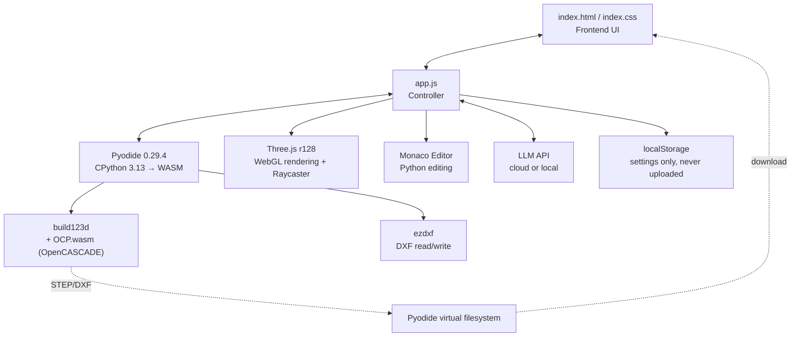

# Text-to-CAD Studio

**English** · [繁體中文](README.zh-TW.md)

> A parametric CAD workstation that runs entirely in your browser: describe a part in plain language → an LLM writes `build123d` Python → Pyodide (WebAssembly) compiles it → Three.js renders it, with STEP / DXF export.
>
> **No backend, no server.** Every geometry operation happens inside your browser tab, and your API key never leaves `localStorage`.


---

## ⚠️ Where This Is Stuck (read this first)

**The project works, but "click a feature and modify it with words" is not reliable yet.** That is the heart of the project and the hardest part, and it remains unsolved. If you plan to fork or contribute, this section is the main battleground.

### The root cause: the Topological Naming Problem

This is a classic, well-known problem in CAD — not something unique to this project. FreeCAD and the wider OpenSCAD ecosystem wrestle with it too.

| # | Problem | What actually happens | Relevant code |
|---|---------|----------------------|---------------|
| 1 | **Feature IDs are unstable** | `Face_12` / `Edge_235` are assigned on the fly by `enumerate(shape.faces())` during tessellation. Re-run the script and OCCT's internal topological ordering shifts, so the same physical face gets a different number. **A selection cannot survive an edit.** | `app.js` → `__wasm_run_and_tessellate()` |
| 2 | **Selection falls back to coordinate guessing** | Because IDs are unstable, what actually reaches the LLM is "center point + normal + bbox + area", and the Python side resolves it with `find_nearest_face()` / `find_nearest_edge()` nearest-distance matching. | `app.js` → helper injection block |
| 3 | **Symmetric parts break the heuristic** | Following from above: on symmetric or repeated geometry (a 3×3 subdivided cube, for example) several face centers sit very close together, and nearest-distance matching frequently grabs the wrong one. | same as above |
| 4 | **Single selection only** | `STATE.selectedFeature` is a single object rather than an array, so "fillet these four edges together" is impossible. | `app.js` → `STATE` |
| 5 | **No vertex selection** | Only faces and edges are tessellated; vertices never enter the raycast list at all. | `app.js` → `renderMesh()` |
| 6 | **Edge-priority is a hack** | To make back-facing edges (occluded by front faces) clickable, the raycaster forcibly ranks `THREE.Line` above `THREE.Mesh`. Side effect: faces near a boundary become hard to click. | `app.js` → `onCanvasClick()` |
| 7 | **Every edit rewrites the whole script** | There is no real feature tree. Each modification asks the LLM to return the complete script, and previous edits are preserved only because the prompt insists on it — the model still wipes them occasionally. That is precisely why Undo exists. | `app.js` → `handlePromptSubmit()` |

### Possible directions (PRs very welcome)

1. **Switch to build123d's semantic selectors** — the most promising path.
   Have the LLM emit **semantic, recomputable** selectors like `faces().filter_by(Axis.Z).sort_by(Axis.Z)[-1]` instead of hard-coded coordinates. Selections would then stay valid after a re-run, which is what "parametric" actually means.

2. **Stable feature fingerprints**
   Drop sequence numbers and hash a combination of geometric invariants instead: `(area, normal, perimeter, adjacent face count, position relative to centroid)`. Restore selections by fingerprint matching after each recompute.

3. **Multi-select and selection sets**
   Turn `selectedFeature` into an array, support Shift-click in the UI, and pass several features into a single prompt.

4. **Hover preview**
   Highlight before the click lands so the user can confirm the right face is being targeted.

5. **A real feature tree**
   Maintain an operation-history data structure (`[import, chamfer(edge_fingerprint, 3mm), drill(face_fingerprint, ⌀5)]`) so the LLM appends or edits nodes rather than rewriting everything.

---

## ✨ What Works Today

- 🗣️ **Natural-language modeling** — describe a part, get a generated and executed `build123d` script
- 🖱️ **Click to select faces / edges** — coordinates and normals are injected into the next prompt automatically
- 🔁 **Automatic error repair** — on a compile failure the traceback is fed straight back to the model (up to 2 retries)
- ↩️ **Undo** — 25 steps of script history, so a bad AI edit is recoverable
- 📐 **2D / 3D dual mode** — 3D exports STEP, 2D exports DXF
- 📥 **STEP / DXF import** — keep editing an existing drawing with language
- 🧰 **Parametric toolbar** — Line / Arc / Rectangle / Circle / Box / Sweep / Revolve / Boolean / Fillet…, fill in values and the code is inserted
- ✏️ **Monaco editor** — hand-edit the Python and re-run at any time
- 📊 **Benchmark suite** — 6 built-in cases of increasing difficulty (calibration block → aerospace clevis bracket)
- 🔑 **BYOK, multi-provider** — OpenAI / OpenRouter / Anthropic / Gemini / local Ollama / LM Studio

---

## 🏗️ Architecture



### The three core components

#### 1️⃣ CAD compilation engine — Pyodide + OCP.wasm

The real difficulty is that `build123d` sits on top of **OpenCASCADE (OCCT)** — a large C++ geometry kernel. This project solves that with [**yeicor/OCP.wasm**](https://github.com/yeicor/OCP.wasm), a wheel registry of OCCT compiled to WebAssembly:

```python
import micropip
micropip.set_index_urls(["https://yeicor.github.io/OCP.wasm", "https://pypi.org/simple"])
await micropip.install("lib3mf")
micropip.add_mock_package("py-lib3mf", "2.4.1", modules={"py_lib3mf": "from lib3mf import *"})
await micropip.install(["build123d", "sqlite3"])
```

The first load pulls roughly 30 MB and takes 20–60 seconds; after that the browser caches it.

#### 2️⃣ AI inference engine — dual-track BYOK

A single `generateCAD()` dispatcher, with configuration stored in `localStorage.cad_ai_config`:

| Provider | Endpoint | Notes |
|----------|----------|-------|
| OpenAI | `https://api.openai.com/v1` | standard `/chat/completions` |
| OpenRouter | `https://openrouter.ai/api/v1` | requires `HTTP-Referer` |
| Anthropic | `https://api.anthropic.com/v1` | `x-api-key` + `anthropic-version` |
| Google Gemini | `generativelanguage.googleapis.com` | dedicated schema, with model fallback and 429/503 retries |
| Local | `http://localhost:11434/v1` (Ollama)<br/>`http://localhost:1234/v1` (LM Studio) | fully offline capable |

#### 3️⃣ 3D visualization and interaction — Three.js

The Python side tessellates each face individually into `{vertices, indices, center, normal, bbox, area}` JSON. The JS side then builds **a separate `THREE.Mesh` for every face** (rather than one mesh for the whole body) and attaches the feature metadata to `mesh.userData`, which is what lets the raycaster tell one face from another.

```
Python: shape.faces() → tessellate → JSON
   ↓
JS: one Mesh per face, userData = { id, center, normal, bbox, area }
   ↓
Raycaster click → highlight + inject prompt context
```

---

## 🔗 Projects Used

| Project | Role | License |
|---------|------|---------|
| [earthtojake/text-to-cad](https://github.com/earthtojake/text-to-cad) | Agent-skills collection; the design inspiration and the basis for this project's system prompt conventions | see upstream |
| [build123d](https://github.com/gumyr/build123d) | Python parametric CAD modeling library | Apache-2.0 |
| [yeicor/OCP.wasm](https://github.com/yeicor/OCP.wasm) | OpenCASCADE as a WebAssembly wheel registry ⭐ the thing that makes this possible | LGPL-2.1 |
| [Pyodide](https://pyodide.org/) | CPython runtime in the browser | MPL-2.0 |
| [Three.js](https://threejs.org/) | WebGL rendering and raycasting | MIT |
| [Monaco Editor](https://microsoft.github.io/monaco-editor/) | The editor from VS Code | MIT |
| [ezdxf](https://github.com/mozman/ezdxf) | DXF read/write | MIT |
| [Chart.js](https://www.chartjs.org/) | Usage dashboard charts | MIT |

---

## 🚀 Quick Start

### Option A — just open the file (no install, no server)

```bash
git clone https://github.com/drogertieni/text-to-cad-studio.git
```

Then double-click `index.html`, or drag it into your browser.

That is genuinely all it takes. Every dependency (Pyodide, build123d, Three.js, Monaco) is fetched from CDNs that send `Access-Control-Allow-Origin: *`, and the app never reads a local file, so the `file://` origin is not a problem. Verified working in Chrome from `file:///…/index.html`: Pyodide and build123d load, scripts compile, and `localStorage` settings persist.

### Option B — local HTTP server

```bash
cd text-to-cad-studio
npm install
npm run dev   # http://localhost:8000
```

Worth it if you want a stable origin for `localStorage`, plan to edit the source with live reload, or hit the caveat below.

> **Caveat for local LLMs on `file://`:** a page served from `file://` sends `Origin: null`. Ollama and LM Studio reject that by default, so **Option B is required if you use a local model.** For Ollama, serving over HTTP fixes it; alternatively set `OLLAMA_ORIGINS="*"` before `ollama serve`. Cloud providers (OpenAI, Gemini, Anthropic, OpenRouter) work fine either way.

Either way, the first load pulls ~30 MB and takes 20–60 seconds while OpenCASCADE is downloaded and cached.

### Configuring the AI

Click ⚙️ in the top right → pick a provider → enter your API key or local endpoint → Save.

**Fully local, no API key required:**

```bash
ollama serve
ollama pull qwen2.5-coder
```

Then choose "Local Endpoint" in settings and set the endpoint to `http://localhost:11434/v1`.

---

## 🔐 Privacy and Security

- **Your API key lives only in your browser's `localStorage`.** It is never written to a file and never sent to any server belonging to this project — this project has no server.
- Requests go directly from your browser to whichever LLM provider you chose.
- This repo's `.gitignore` already excludes common secret-file patterns such as `.env` and `*.key`.
- To swap a key, just overwrite it in the settings panel; to remove it completely, clear the site data in your browser.

---

## 📁 Project Layout

```
.
├── index.html        # Main app (UI, toolbar, settings panel)
├── index.css         # Styles
├── app.js            # Core controller (Pyodide / Three.js / LLM dispatch / system prompt)
├── dashboard.html    # Usage dashboard
├── dashboard.css
├── dashboard.js
├── aluminum_bar.py   # Example build123d script
└── package.json      # A single devDependency: http-server
```

Main sections of `app.js`:

| Section | Responsibility |
|---------|----------------|
| `STATE` | Global state (Pyodide, editor, selected feature, script history) |
| `initPyodide()` | Load the WASM runtime and build123d |
| `runPythonCode()` | Execute the user script, inject selection helpers, tessellate, export |
| `initThree()` / `onCanvasClick()` | 3D scene and click raycasting |
| `getSystemPrompt()` | The LLM system prompt (including build123d operation examples) |
| `generateCAD()` | Multi-provider API dispatch |
| `TOOLBAR_CONFIG` | Parametric toolbar definitions |

---

## 🤝 Contributing

The most valuable help is on the "Where This Is Stuck" section above. If you have ideas about the **topological naming problem**, **build123d selectors**, or **CAD selection UX** in general, please open an issue to discuss or send a PR directly.

## 📄 License

MIT — see [LICENSE](LICENSE).

Note that each dependency carries its own license, in particular **OCP.wasm (LGPL-2.1)** and **build123d (Apache-2.0)**.
