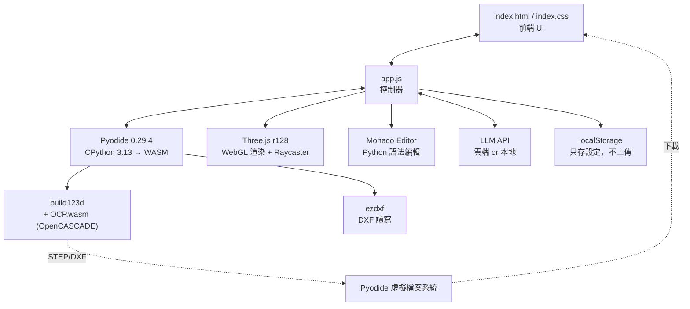

# Text-to-CAD Studio

**繁體中文** · [English](README.md)

> 一個完全跑在瀏覽器裡的參數化 CAD 工作站 —— 與一次性的 text-to-CAD 生成器不同，**你可以直接點選生成模型上的面或邊，再用一句話告訴它要怎麼改。**
>
> 用自然語言描述零件（或匯入既有的 STEP / DXF），LLM 產生 `build123d` Python，Pyodide (WebAssembly) 即時編譯，Three.js 顯示，且每一個面與每一條邊都可個別點選。可匯出 STEP / DXF。
>
> **無後端、無伺服器。** 所有幾何運算都在你的瀏覽器分頁內完成，API Key 只存在 `localStorage`。

[](https://drogertieni.github.io/text-to-cad-studio/)


### 👉 [**直接在瀏覽器裡試用 — 免安裝**](https://drogertieni.github.io/text-to-cad-studio/)

自備 API Key（或指向本機的 Ollama / LM Studio）即可開始建模。不需安裝任何東西、不會上傳任何資料，你的電腦也不需要 Python 或 OpenCASCADE 環境。

---

## 💡 核心概念：用滑鼠指出來，然後用嘴巴改

大多數 text-to-CAD 工具都是一次性的：你寫一段 prompt、得到一個模型，如果哪裡不對，唯一的辦法是整段重寫再賭一次。**這個專案把這個迴圈接起來了。**

1. 描述一個零件 —— 或匯入既有的 STEP / DXF 檔案
2. **在 3D 視窗中點選一個面或一條邊**，它會以金黃色高亮
3. 直接說出你要對**這個特定特徵**做什麼：
   *「這條邊倒圓角 3mm」* · *「這個面鑽一個 5mm 的孔」* · *「這個面往外延伸 10mm」*
4. 這一次點擊會在背景被轉譯成模型能夠推理的幾何資訊，並自動附加到你的 prompt 上：

   ```
   Selected topological face 'Face_348' at center (16.540, 25.000, 16.540);
   normal vector (1.000, 0.000, 0.000);
   axis-aligned bbox min (16.540, 16.670, 8.330) max (16.540, 33.330, 24.990),
   size 0.000 x 16.670 x 16.670 mm; area 277.890 mm²
   ```

5. 重新產生的 `build123d` 腳本在瀏覽器內重新編譯，視窗即時更新。不滿意的話，Undo 只要點一下

**你完全不需要用文字去描述「是哪一個面」—— 你直接指給它看。** 這就是整個專案的核心主張，而困難的問題也全都出在這裡（見下一節）。

為了做到這件事，Python 端會將每一個面**個別** tessellate，JS 端則為每個面各自建立一個 `THREE.Mesh` 並把特徵資訊掛在 `userData` 上，這樣 raycaster 才能分辨你點到的是哪一個面。

---

## ⚠️ 目前卡關的部分（先看這裡）

上面描述的這個迴圈**確實能運作** —— 在簡單的零件上，你可以點一個面、要求鑽孔或倒圓角，然後得到正確結果。但只要幾何一重複、或是連續做好幾次修改，品質就會急遽下滑，而且**選取狀態完全無法在重新編譯後存活**。這道「Demo 很漂亮」與「真正可用」之間的落差，就是本專案最難的問題，目前仍未解決。

如果你打算貢獻，這一節就是主戰場。

### 問題本質：拓樸命名問題 (Topological Naming Problem)

這是 CAD 領域的經典難題，不是這個專案獨有的 —— FreeCAD、OpenSCAD 生態都在跟它搏鬥。

| # | 問題 | 具體狀況 | 相關程式碼 |
|---|------|---------|-----------|
| 1 | **特徵 ID 不穩定** | `Face_12` / `Edge_235` 是每次 tessellation 時用 `enumerate(shape.faces())` 當場編號的。腳本一重跑，OCCT 內部拓樸順序改變，同一個實體面的編號就跟著變。**選取無法跨越編輯而存活。** | `app.js` → `__wasm_run_and_tessellate()` |
| 2 | **只能靠座標猜測** | 因為 ID 不穩，實際餵給 LLM 的是「中心座標 + 法向量 + bbox + 面積」，Python 端再用 `find_nearest_face()` / `find_nearest_edge()` 做最近距離比對。 | `app.js` → helper 注入區 |
| 3 | **對稱件容易選錯** | 承上，在對稱或重複結構（例如 3×3 分面立方體）上，多個面的中心距離非常接近，最近距離比對經常抓錯目標。 | 同上 |
| 4 | **只能單選** | `STATE.selectedFeature` 是單一物件而非陣列，做不到「這四條邊一起倒圓角」。 | `app.js` → `STATE` |
| 5 | **沒有頂點選取** | 只 tessellate faces 與 edges，vertex 完全沒進 raycast 清單。 | `app.js` → `renderMesh()` |
| 6 | **邊優先是個 hack** | 為了讓「背面被前面遮住的邊」點得到，raycaster 硬性把 `THREE.Line` 排在 `THREE.Mesh` 前面。副作用：靠近邊界的面反而點不到。 | `app.js` → `onCanvasClick()` |
| 7 | **修改是「重寫整份腳本」** | 沒有真正的 feature tree。每次修改都要求 LLM 回傳完整腳本，前一次的修改靠 prompt 要求「累積保留」，模型偶爾還是會洗掉 —— 這也是為什麼加了 Undo。 | `app.js` → `handlePromptSubmit()` |

### 可能的解法方向（歡迎 PR）

1. **改用 build123d 的語意選擇器**（最有希望）
   讓 LLM 產生 `faces().filter_by(Axis.Z).sort_by(Axis.Z)[-1]` 這類**語意化、可重算**的選擇器，取代硬編碼座標。這樣腳本重跑後選取依然有效，才是真正的參數化。

2. **穩定的特徵指紋**
   不用序號，改用幾何不變量組合出雜湊：`(面積, 法向, 週長, 相鄰面數, 相對重心位置)`。重算後靠指紋比對還原選取。

3. **多選 + 選取集合**
   把 `selectedFeature` 改成陣列，UI 支援 Shift 加選，prompt 一次帶入多個特徵。

4. **hover 預覽**
   點下去之前先高亮，讓使用者確認抓到的是不是想要的那個面。

5. **真正的 feature tree**
   維護「操作歷史」資料結構（`[匯入, 倒角(edge_fingerprint, 3mm), 鑽孔(face_fingerprint, ⌀5)]`），讓 LLM 只增修節點而非重寫全文。

---

## ✨ 目前可用的功能

- 🗣️ **自然語言建模** — 描述零件 → 自動產生並執行 `build123d` 腳本
- 🖱️ **點選面 / 邊** — 點擊 3D 模型的面或邊，座標與法向自動注入下一次 prompt
- 🔁 **自動修錯** — 編譯失敗時自動把 traceback 回傳給模型重試（最多 2 次）
- ↩️ **Undo** — 25 步腳本歷史，AI 改壞了可以退回
- 📐 **2D / 3D 雙模式** — 3D 出 STEP、2D 出 DXF
- 📥 **匯入 STEP / DXF** — 在既有圖檔上繼續用語言修改
- 🧰 **參數化工具列** — Line / Arc / Rectangle / Circle / Box / Sweep / Revolve / Boolean / Fillet…，填數值直接插入程式碼
- ✏️ **Monaco 編輯器** — 隨時手動改 Python 再重跑
- 📊 **Benchmark 測試組** — 內建 6 組漸進難度的標準題（校準方塊 → 叉形輕量化支架）
- 🔑 **BYOK 多供應商** — OpenAI / OpenRouter / Anthropic / Gemini / 本地 Ollama / LM Studio

---

## 🏗️ 技術架構



### 三大核心元件

#### 1️⃣ CAD 編譯引擎 — Pyodide + OCP.wasm

真正的難點在於 `build123d` 底層是 **OpenCASCADE (OCCT)** —— 一套龐大的 C++ 幾何核心。本專案透過 [**yeicor/OCP.wasm**](https://github.com/yeicor/OCP.wasm) 這個把 OCCT 編譯成 WebAssembly 的 wheel registry 解決：

```python
import micropip
micropip.set_index_urls(["https://yeicor.github.io/OCP.wasm", "https://pypi.org/simple"])
await micropip.install("lib3mf")
micropip.add_mock_package("py-lib3mf", "2.4.1", modules={"py_lib3mf": "from lib3mf import *"})
await micropip.install(["build123d", "sqlite3"])
```

首次載入約需下載 30MB 並花費 20–60 秒，之後由瀏覽器快取。

#### 2️⃣ AI 推論引擎 — BYOK 雙軌制

統一的 `generateCAD()` 分派器，設定存在 `localStorage.cad_ai_config`：

| Provider | 端點 | 備註 |
|----------|------|------|
| OpenAI | `https://api.openai.com/v1` | 標準 `/chat/completions` |
| OpenRouter | `https://openrouter.ai/api/v1` | 需帶 `HTTP-Referer` |
| Anthropic | `https://api.anthropic.com/v1` | `x-api-key` + `anthropic-version` |
| Google Gemini | `generativelanguage.googleapis.com` | 專用 schema，含模型 fallback 與 429/503 重試 |
| 本地 | `http://localhost:11434/v1` (Ollama)<br/>`http://localhost:1234/v1` (LM Studio) | 完全離線可用 |

#### 3️⃣ 3D 視覺化與互動 — Three.js

Python 端把每個 face 個別 tessellate 成 `{vertices, indices, center, normal, bbox, area}` JSON，JS 端為**每一個面建立獨立的 `THREE.Mesh`**（而非整體一個），把特徵資訊掛在 `mesh.userData` 上，這樣 Raycaster 才能分辨點到哪一個面。

```
Python: shape.faces() → tessellate → JSON
   ↓
JS: 每個 face 一個 Mesh，userData = { id, center, normal, bbox, area }
   ↓
Raycaster 點擊 → 高亮 + 注入 prompt context
```

---

## 🔗 使用到的專案

| 專案 | 用途 | 授權 |
|------|------|------|
| [earthtojake/text-to-cad](https://github.com/earthtojake/text-to-cad) | Agent skills 集合，本專案的設計理念來源與 system prompt 規範基礎 | 見上游 |
| [build123d](https://github.com/gumyr/build123d) | Python 參數化 CAD 建模函式庫 | Apache-2.0 |
| [yeicor/OCP.wasm](https://github.com/yeicor/OCP.wasm) | OpenCASCADE 的 WebAssembly wheel registry ⭐ 讓一切成為可能 | LGPL-2.1 |
| [Pyodide](https://pyodide.org/) | 瀏覽器內的 CPython 執行環境 | MPL-2.0 |
| [Three.js](https://threejs.org/) | WebGL 3D 渲染與 Raycasting | MIT |
| [Monaco Editor](https://microsoft.github.io/monaco-editor/) | VS Code 同款程式碼編輯器 | MIT |
| [ezdxf](https://github.com/mozman/ezdxf) | DXF 讀寫 | MIT |
| [Chart.js](https://www.chartjs.org/) | 用量儀表板圖表 | MIT |

---

## 🚀 快速開始

### 方式 A — 線上版（完全免安裝）

**<https://drogertieni.github.io/text-to-cad-studio/>**

打開後點 ⚙️ 填入 API Key，就能開始描述零件。這就是 `main` 分支的同一份程式碼，由 GitHub Pages 以 HTTPS 提供。

### 方式 B — 下載後直接開檔（免安裝、免伺服器）

```bash
git clone https://github.com/drogertieni/text-to-cad-studio.git
```

然後直接**雙擊 `index.html`**，或把它拖進瀏覽器即可。

真的就這樣。所有相依套件（Pyodide、build123d、Three.js、Monaco）都從 CDN 載入，而這些 CDN 都帶有 `Access-Control-Allow-Origin: *`；本專案又不讀取任何本機檔案，所以 `file://` 完全不受影響。已在 Chrome 以 `file:///…/index.html` 實測：Pyodide 與 build123d 正常載入、腳本正常編譯、`localStorage` 設定正常保存。

### 方式 C — 本機 HTTP 伺服器

```bash
cd text-to-cad-studio
npm install
npm run dev   # http://localhost:8000
```

若你想要固定的 `localStorage` origin、要改原始碼搭配即時重載，或遇到下方的限制，就用這個方式。

> **本地 LLM 在 `file://` 下的限制：** 從 `file://` 開啟的頁面送出的是 `Origin: null`，Ollama 與 LM Studio 預設會拒絕。**因此使用本地模型時必須用方式 C。** 以 Ollama 為例，改用 HTTP 伺服器即可解決；或者在 `ollama serve` 前設定 `OLLAMA_ORIGINS="*"`。雲端供應商（OpenAI、Gemini、Anthropic、OpenRouter）兩種方式都正常。

無論選哪一種，首次載入都需下載約 30MB 並花費 20–60 秒（下載 OpenCASCADE），之後由瀏覽器快取。

### 部署自己的版本

因為本專案是純靜態、無建置步驟，任何靜態主機都能部署。以 GitHub Pages 為例：

1. Fork 或推送本專案到你的帳號
2. **Settings → Pages → Source 選 `Deploy from a branch` → Branch 選 `main` / `(root)` → Save**
3. 等待數分鐘完成首次建置，你的版本會出現在 `https://<帳號>.github.io/<repo>/`

不需要 workflow 檔、不需要建置步驟、也不需要設定任何 secret —— API Key 由每位訪客在自己的瀏覽器中填入，所以公開部署絕不會夾帶你的憑證。

### 設定 AI

點右上角 ⚙️ → 選 Provider → 填入 API Key 或本地端點 → Save。

**本地離線方案（不需要任何 API Key）：**

```bash
ollama serve
ollama pull qwen2.5-coder
```

然後在設定裡選「Local Endpoint」，端點填 `http://localhost:11434/v1`。

---

## 🔐 隱私與安全

- **API Key 只存在你瀏覽器的 `localStorage`**，不會寫入任何檔案、不會送到本專案的任何伺服器（本專案根本沒有伺服器）。
- 請求直接從你的瀏覽器送到你選擇的 LLM 供應商。
- 本 repo 的 `.gitignore` 已排除 `.env`、`*.key` 等常見機密檔案樣式。
- 若要換掉 Key，設定面板覆寫即可；要完全清除請清空瀏覽器的網站資料。

---

## 📁 專案結構

```
.
├── index.html        # 主應用程式（UI、工具列、設定面板）
├── index.css         # 樣式
├── app.js            # 核心控制器（Pyodide / Three.js / LLM 分派 / system prompt）
├── dashboard.html    # 用量儀表板
├── dashboard.css
├── dashboard.js
├── aluminum_bar.py   # build123d 範例腳本
└── package.json      # 只有 http-server 一個 devDependency
```

`app.js` 的主要區塊：

| 區塊 | 職責 |
|------|------|
| `STATE` | 全域狀態（Pyodide、編輯器、選取特徵、腳本歷史） |
| `initPyodide()` | 載入 WASM 執行環境與 build123d |
| `runPythonCode()` | 執行使用者腳本、注入選取 helper、tessellate、匯出 |
| `initThree()` / `onCanvasClick()` | 3D 場景與點選 raycasting |
| `getSystemPrompt()` | LLM 的 system prompt（含 build123d 操作範例） |
| `generateCAD()` | 多供應商 API 分派 |
| `TOOLBAR_CONFIG` | 參數化工具列定義 |

---

## 🤝 貢獻

最需要幫忙的就是上面「卡關」那一節。若你對 **拓樸命名問題**、**build123d 選擇器**、或 **CAD 幾何選取 UX** 有想法，非常歡迎開 Issue 討論或直接送 PR。

## 📄 授權

MIT — 詳見 [LICENSE](LICENSE)。

請注意各相依專案有各自的授權條款，特別是 **OCP.wasm (LGPL-2.1)** 與 **build123d (Apache-2.0)**。
